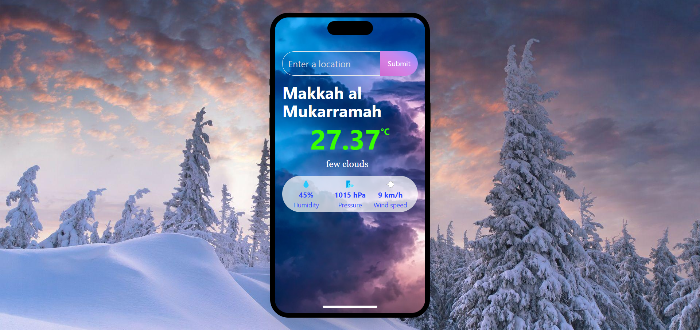

# Weather Web App

## Check Out the Demo
Explore Trendmedia: Demo Link (https://worldwideweathermap.vercel.app/)

## Description
Welcome to the Weather Web App! This web application allows users to obtain real-time weather information for various locations around the world. It provides accurate weather forecasts, current conditions, and interactive maps to keep users informed about the weather in their desired locations.

## Features

- Real-Time Weather Data: View up-to-date weather information for any location.
- Custom Location Search: Search for weather information by entering the desired location.

## Technologies Used

- Frontend: CSS, HTMl, JavaScript, React.js, Tailwind CSS
- Weather API: Weather map API

## Getting Started

To get started with the Weather Web App, follow these steps:

1. Clone the repository to your local machine.
2. Install the necessary dependencies by running `npm install`.
3. Obtain an API key for the weather API service and add it to the configuration.
4. Run the app using `npm start` or `npm run dev`.

## What I Learned

In developing this weather web app, I gained valuable experience in utilizing React.js and Tailwind CSS to create a responsive and visually appealing user interface. Additionally, working with real-time weather data and integrating a weather API provided insights into handling external data sources and presenting information to users in a clear and informative manner. This project also enhanced my understanding of API integration, search functionality, and user experience design in web applications.

## Contributing

If you'd like to contribute to the Weather Web App, feel free to fork the repository and submit a pull request with your changes. We welcome any contributions that aim to improve the functionality, user experience, or code quality of the app.

## Acknowledgements

- Insert any third-party libraries or resources used
- Optional: Any acknowledgements to individuals or organizations

## Contact

For any inquiries or feedback regarding the Weather Web App, please feel free to contact the project maintainer at insert email or contact information.

## Screenshots

